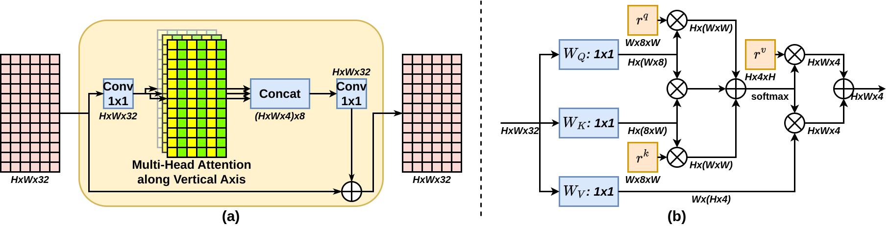

# MCPDepth: Omnidirectional Depth Estimation via Stereo Matching from Multi-Cylindrical Panoramas
Official PyTorch implementation of paper:

MCPDepth: Omnidirectional Depth Estimation via Stereo Matching from Multi-Cylindrical Panoramas,

Authors: Feng Qiao, Zhexiao Xiong, Nathan Jacobs, Xinge Zhu, Yuexin Ma, Qiumeng He 


## Hilights

### Cylindrical projection
A comparison for stereo matching of paired panoramas under spherical and cylindrical projection:


### Circular Attention
The circular attention module is used to overcome the distortion along the vertical axis.



## Dataset preparation
### Deep360
Download: [Deep360](https://drive.google.com/drive/folders/1YJIaqDGWMTmGF0tyW8ktfG26xk-jSntg?usp=sharing). More details can be founde in [MODE](https://github.com/nju-ee/MODE-2022).
```shell
cd scripts
# change the dataset name, root_path, and save_path in the file and then run
python spherical2cylindrical_disp.py  # convert disparity
python spherical2cylindrical.py  # convert RGB image
```

### 3D60 dataset preparation
Download: [3D60](https://vcl3d.github.io/Pano3D/download/#Download)
```shell
# convert panorama to Cassini Projection
cd dataloader
python dataset3D60Loader.py
# convert Cassini Projection to cylindrical panorama
cd ../scripts
# change the dataset name, root_path, and save_path in the file and then run
python spherical2cylindrical_disp.py  # convert disparity
python spherical2cylindrical.py  # convert RGB image
```


## Requirements
+ gcc/g++ <=7.5.0 (to compile the sphere convolution operator)
+ PyTorch >=1.5.0
+ tensorboardX
+ cv2
+ numpy
+ PIL
+ numba
+ prettytable (to show the error metrics)
+ tqdm (to visualize the progress bar)


## Usage
```shell
# trian stereo matching model
bash train_disparity.sh
# test stereo matching model
bash test_disparity.sh
# generate predicted disparity maps and confidence maps
bash save_output_disparity_stage.sh
# train fusion model
bash train_fusion.sh
# test fusion model
bash test_fusion.sh
```

## Pretrained Models
Our pre-trained models can be found `./pretrained_model`


## Acknowledgements
Our project rely on some awesome repos : [MODE](https://github.com/nju-ee/MODE-2022), [PSMNet](https://github.com/JiaRenChang/PSMNet). We thank the original authors for their excellent work.

## Citation
If you find our work useful in your research, please consider citing our paper:

```shell

```