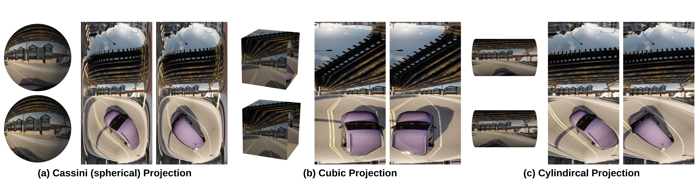
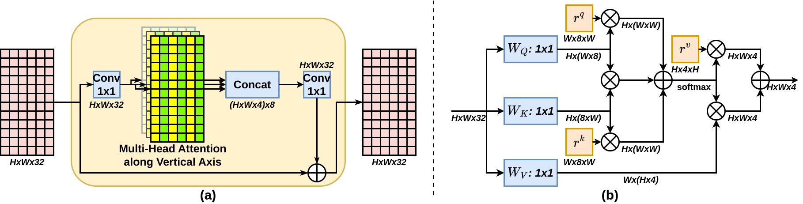

# MCPDepth: Omnidirectional Depth Estimation via Stereo Matching from Multi-Cylindrical Panoramas
Feng Qiao, Zhexiao Xiong, Xinge Zhu, Yuexin Ma, Qiumeng He, Nathan Jacobs

[](https://github.com/Qjizhi/MCPDepth) &nbsp;
[](https://arxiv.org/abs/2408.01653) &nbsp;
[](https://sites.google.com/view/omnicv2026)

> **Accepted by CVPR 2026 OmniCV Workshop** 🎉

## Introduction
We introduce Multi-Cylindrical Panoramic Depth Estimation (MCPDepth), a novel two-stage framework designed to enhance omnidirectional depth estimation through stereo matching across multiple cylindrical panoramas. Our method leverages the geometric advantages of cylindrical projections for improved stereo correspondence while introducing a circular attention mechanism to handle panoramic distortions.

### Cylindrical projection
A qualitative comaprison of Cassini (spherical) projection, cubic projection, and cylindircal projection for stereo matching:


An example of quantitative comparison for stereo matching of paired panoramas under spherical and cylindrical projection:


### Circular Attention
The circular attention module is used to overcome the distortion along the vertical axis.



## Dataset preparation
### Deep360
Download: [Deep360](https://drive.google.com/drive/folders/1YJIaqDGWMTmGF0tyW8ktfG26xk-jSntg?usp=sharing). More details can be founde in [MODE](https://github.com/nju-ee/MODE-2022).
```shell
cd scripts
# change the dataset name, root_path, and save_path in the file and then run
python spherical2cylindrical_disp.py  # convert disparity
python spherical2cylindrical.py  # convert RGB image
```

### 3D60 dataset preparation
Download: [3D60](https://vcl3d.github.io/Pano3D/download/#Download)
```shell
# convert panorama to Cassini Projection
cd dataloader
python dataset3D60Loader.py
# convert Cassini Projection to cylindrical panorama
cd ../scripts
# change the dataset name, root_path, and save_path in the file and then run
python spherical2cylindrical_disp.py  # convert disparity
python spherical2cylindrical.py  # convert RGB image
```


## Requirements
+ gcc/g++ <=7.5.0 (to compile the sphere convolution operator)
+ PyTorch >=1.5.0
+ tensorboardX
+ cv2
+ numpy
+ PIL
+ numba
+ prettytable (to show the error metrics)
+ tqdm (to visualize the progress bar)


## Usage
```shell
# trian stereo matching model
bash train_disparity.sh
# test stereo matching model
bash test_disparity.sh
# generate predicted disparity maps and confidence maps
bash save_output_disparity_stage.sh
# train fusion model
bash train_fusion.sh
# test fusion model
bash test_fusion.sh
```

## Pretrained Models
Our pre-trained models can be found `./pretrained_model`


## Acknowledgements
Our project rely on some awesome repos : [MODE](https://github.com/nju-ee/MODE-2022), [PSMNet](https://github.com/JiaRenChang/PSMNet). We thank the original authors for their excellent work.

## Citation
If you find our work useful in your research, please consider citing our paper:

```bibtex
@InProceedings{Qiao_2026_CVPR,
    author    = {Qiao, Feng and Xiong, Zhexiao and Zhu, Xinge and Ma, Yuexin and He, Qiumeng and Jacobs, Nathan},
    title     = {MCPDepth: Practical Omnidirectional Depth Estimation from Multiple Cylindrical Panoramas via Stereo Matching},
    booktitle = {Proceedings of the IEEE/CVF Conference on Computer Vision and Pattern Recognition (CVPR) Workshops},
    month     = {June},
    year      = {2026},
    pages     = {10103-10113}
}
```
